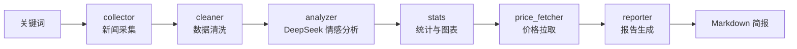

# 大宗商品舆情监测与价格分析 Agent

## 项目简介

输入商品关键词（如"原油"），自动完成：新闻采集 → 数据清洗 → DeepSeek 情感分析
→ 统计可视化 → 价格对比 → 生成 Markdown 简报。

## 架构图



## 项目结构

```text
commodity-sentiment-agent/
├── src/
│   ├── __init__.py
│   ├── collector.py       # GDELT 新闻采集
│   ├── cleaner.py         # pandas 数据清洗
│   ├── analyzer.py        # DeepSeek 情感分析
│   ├── stats.py           # 统计与图表
│   ├── price_fetcher.py   # yfinance 价格拉取
│   └── reporter.py        # Markdown 简报
├── prompts/
│   ├── __init__.py
│   └── sentiment_prompt.py # 情感分析提示词
├── outputs/               # 运行输出（图表、简报）
├── examples/              # 示例输出
├── docs/
│   └── requirements.md    # 需求文档
├── main.py                # 命令行入口
├── requirements.txt
├── .env.example
└── .gitignore
```

## 核心亮点

- 数据+AI 结合：LLM 只负责语义理解，规则化处理交给 pandas
- 严格 Prompt 工程：JSON 结构化输出、temperature=0、字段校验
- 容错设计：外部 API 不稳定时自动降级到模拟数据，保证流水线不中断
- 4 张可视化图表 + 结构化 Markdown 简报

## 快速开始

### 环境要求

- Python 3.10+（已在 3.14 上验证）
- 需要 DeepSeek API Key

### 安装

```bash
pip install -r requirements.txt
cp .env.example .env
# 在 .env 中填入你的 DEEPSEEK_API_KEY
```

### 运行

```bash
python main.py "原油"
```

可选参数：

```bash
python main.py "原油" --max-records 30
```

> 说明：GDELT 与 yfinance 默认走本地代理 `127.0.0.1:7897`，如需修改请调整 `src/collector.py` 与 `src/price_fetcher.py` 中的 `PROXY`。
