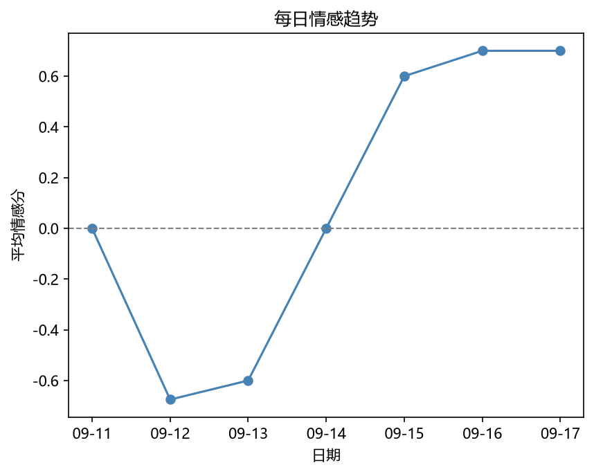
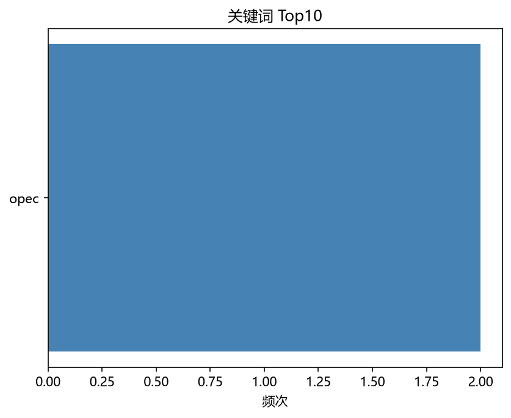
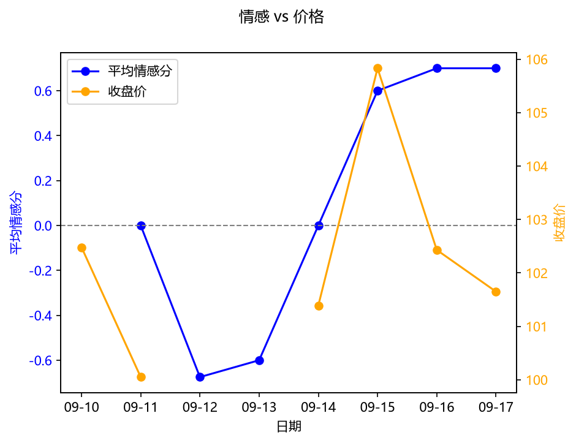

# 原油 舆情简报 — 2026-09-17

> 数据来源：GDELT 新闻 + DeepSeek 情感分析 + yfinance 价格
> 生成时间：2026-09-17 16:03:00

## 一、概览

- 监测新闻总数：10 条
- 时间范围：2026-09-11 至 2026-09-17
- 情感分布：利多 5 条 / 利空 4 条 / 中性 1 条
- 平均情感分：0.075（-1 极度利空，+1 极度利多）

## 二、关键发现

### 利多 Top 3

| 标题 | 来源 | 情感分 | 事件类别 |
|---|---|---|---|
| OPEC+宣布维持减产协议，国际油价应声上涨 | 新浪财经 | 0.70 | 供给变化 |
| 中东地缘局势紧张，原油供应面临中断风险 | 财联社 | 0.70 | 地缘政治 |
| 美国原油库存超预期下降，需求前景获提振 | 华尔街见闻 | 0.70 | 库存数据 |

### 利空 Top 3

| 标题 | 来源 | 情感分 | 事件类别 |
|---|---|---|---|
| 主要经济体制造业数据疲软，油价遭遇抛售 | 路透中文网 | -0.75 | 宏观经济 |
| 美国原油库存意外增加，市场担忧需求疲软 | 新浪财经 | -0.60 | 库存数据 |
| 美元指数走强，大宗商品价格普遍承压 | 财联社 | -0.60 | 宏观经济 |

### 主要事件类别

- 宏观经济：3 条
- 库存数据：2 条
- 供给变化：1 条

## 三、情感趋势

## 四、关键词分布

## 五、情感 vs 价格

## 六、AI 综合研判

市场情绪中性，多空因素交织，建议观望。宏观经济 是本期主导因素。

---

*本报告由大宗商品舆情监测与价格分析 Agent 自动生成，仅供参考，不构成投资建议。*