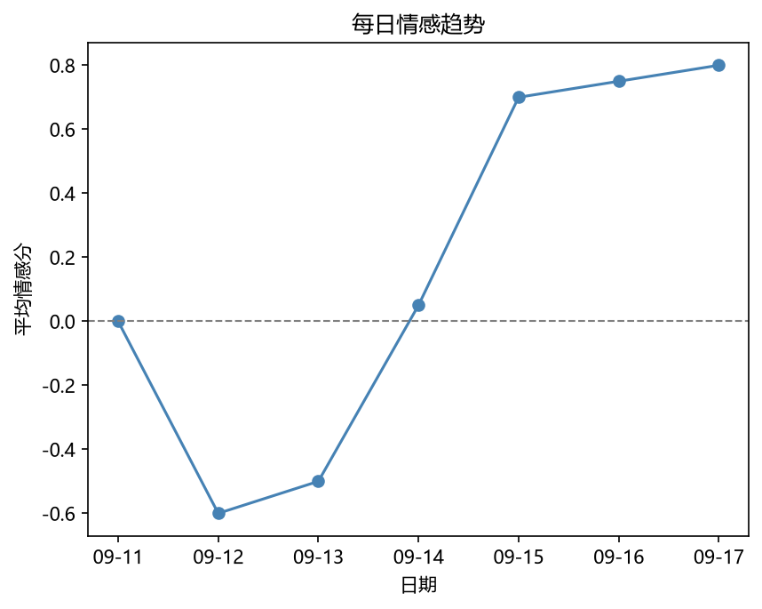
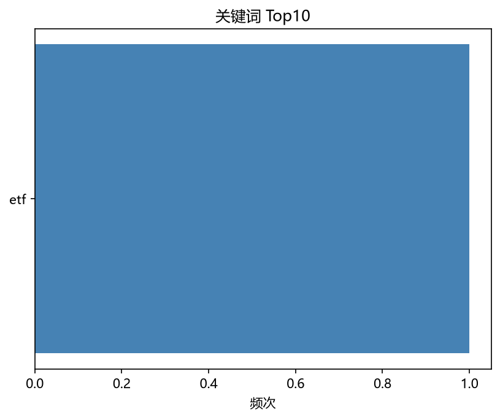
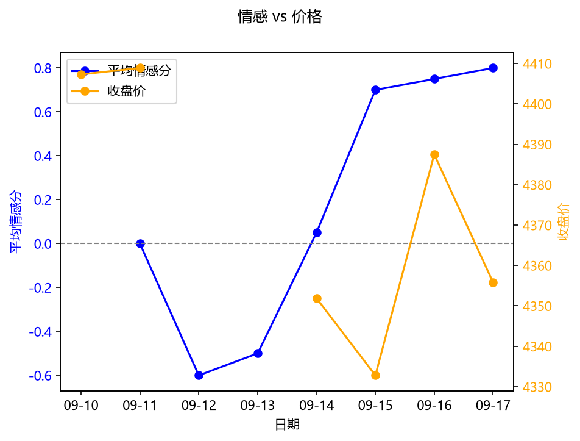

# 黄金 舆情简报 — 2026-09-17

> 数据来源：GDELT 新闻 + DeepSeek 情感分析 + yfinance 价格
> 生成时间：2026-09-17 17:18:04

## 一、概览

- 监测新闻总数：10 条
- 时间范围：2026-09-11 至 2026-09-17
- 情感分布：利多 5 条 / 利空 4 条 / 中性 1 条
- 平均情感分：0.15（-1 极度利空，+1 极度利多）

## 二、关键发现

### 利多 Top 3

| 标题 | 来源 | 情感分 | 事件类别 |
|---|---|---|---|
| 美联储降息预期升温，黄金价格创历史新高 | 新浪财经 | 0.80 | 宏观经济 |
| 地缘局势紧张，避险资金涌入黄金市场 | 财联社 | 0.80 | 地缘政治 |
| 全球央行持续增持黄金，储备需求强劲 | 华尔街见闻 | 0.70 | 需求变化 |

### 利空 Top 3

| 标题 | 来源 | 情感分 | 事件类别 |
|---|---|---|---|
| 美元指数走强，黄金承压回落 | 新浪财经 | -0.60 | 宏观经济 |
| 美国通胀数据超预期，黄金短线跳水 | 财联社 | -0.60 | 宏观经济 |
| 美联储释放鹰派信号，金价承压 | 路透中文网 | -0.60 | 宏观经济 |

### 主要事件类别

- 宏观经济：7 条
- 需求变化：2 条
- 地缘政治：1 条

## 三、情感趋势

## 四、关键词分布

## 五、情感 vs 价格

## 六、AI 综合研判

市场情绪中性，多空因素交织，建议观望。宏观经济是本期主导因素。

---

*本报告由大宗商品舆情监测与价格分析 Agent 自动生成，仅供参考，不构成投资建议。*